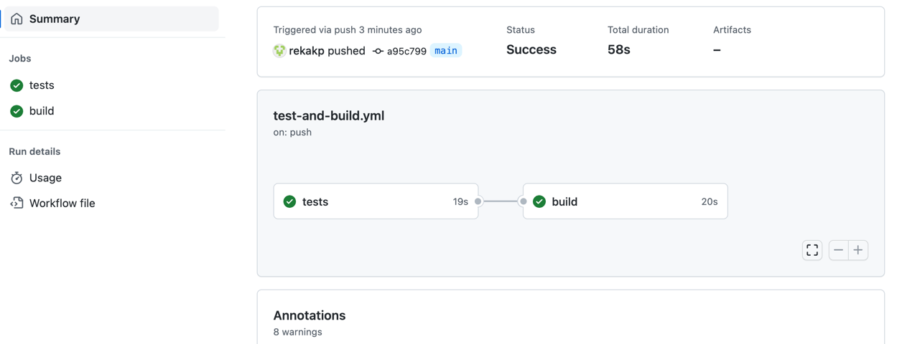

## Problem
The application needs to read the attached AddressBook file and answer the following questions:

- How many males are in the address book?
- Who is the oldest person in the address book?
- How many days older is Bill than Paul?

---

## Tech/framework used
- Java 11
- Gradle
- Junit

---

## Build status

---

## Gradle Build and tests
To run the tests

`./gradlew test`

To build

`./gradlew build`

---
# Code explanation
## Main Entrypoint
AddressBookRunner is the main class.
AddressBookRunner.main() will run the below queries
- How many males are in the address book?
- Who is the oldest person in the address book?
- How many days older is Bill than Paul?

### Design overview

####  Domain
- Gender - enum ( MALE or FEMALE)
- Person  - main domain object corresponding to the person class

####  Service
- FileReadingService - Reads the given file and returns all the lines in the file as List of String. 
- ContentParser  - Parses each line (String) and converts it to Person domain object
- AddressBookQuery - Implements the query commands

### Tests

Integration and Unit tests are written for this problem.

---

## Pipelines

Basic pipelines have been added to test and build the project.

### Validate Pull Request workflow
When a Pull Request is raised, the valid PR workflow is triggered. Only if the steps of the workflow is successful, the PR is allowed to be merged.   
The tests are run as part of this step. Only if the tests are successful, the PR will be allowed to be merged.

### Build and test workflow
The build and test workflow runs everytime the code is merged to master.  
The tests are run and gradle build is also done as part of this workflow.  
Sample workflow run - https://github.com/rekakp/address-book/actions/runs/4403562947
